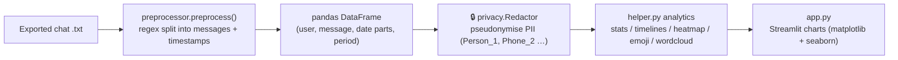

# WhatsApp Chat Analyser

> An interactive **Streamlit** dashboard that turns an exported WhatsApp chat into visual analytics: activity timelines, busiest users, word clouds, emoji breakdowns and more.


Upload a `.txt` export of any WhatsApp conversation (group or 1:1) and the app parses it into a tidy DataFrame, then renders a full analytics report. You can scope every view to the whole chat or to a single participant. A **privacy-by-design** step redacts personal data before anything is analysed (see [PRIVACY.md](PRIVACY.md)).

## Features

- 📊 **Top-line stats**: total messages, words, media and links shared
- 📅 **Timelines**: monthly and daily message volume
- 🗓️ **Activity maps**: busiest day, busiest month, and a day×hour heatmap
- 👥 **Most active users** (group chats) with contribution percentages
- ☁️ **Word cloud** + most-common-words (with Hinglish stop-word filtering)
- 😀 **Emoji analysis**: frequency table and pie chart
- 🔍 **Per-user filtering**: analyse "Overall" or any single participant
- 🔒 **PII redaction** (on by default): names, phone numbers, emails, CNICs and card numbers are pseudonymised before analysis (see [PRIVACY.md](PRIVACY.md))

---

## How It Works



---

## Tech Stack

| Purpose | Library |
|---------|---------|
| UI | Streamlit |
| Data wrangling | pandas, `re` |
| Charts | matplotlib, seaborn |
| Text/NLP | wordcloud, urlextract, emoji, regex |

---

## Getting Started

```bash
pip install -r requirements.txt
streamlit run app.py
```
Then in the sidebar, upload an exported chat (WhatsApp → a chat → ⋮ → *More* → *Export chat* → *Without media*) and click **Show Analysis**.

---

## Project Structure

```
app.py                      Streamlit UI and chart layout
preprocessor.py             Regex parser: raw export -> structured DataFrame
helper.py                   All analytics (stats, timelines, activity, wordcloud, emoji)
stop_hinglish.txt           Stop-word list for Hinglish text
privacy/                    PII redaction package (see PRIVACY.md)
  engines.py                  regex + Presidio detection engines
  redactor.py                 orchestration: parse, detect, pseudonymise, report
  pseudonymizer.py            consistent token mapping (GDPR Art. 4(5))
  patterns.py                 email / phone / CNIC / IBAN / card patterns
  report.py                   privacy / audit report (no real values)
  llm_pass.py                 optional cloud LLM pass (OFF by default)
  cli.py                      `python -m privacy.cli chat.txt -o clean.txt`
  tests/                      unit tests (run offline, no extra installs)
sample_data/synthetic_chat.txt   safe, fake chat for demos & tests
PRIVACY.md                  privacy design, GDPR mapping, usage
```

---

## Privacy

Chat exports are personal data. This project **redacts PII before any analysis**
and never commits real conversations — `sample_data/synthetic_chat.txt` is
fully synthetic. Sanitise an export from the command line:

```bash
python -m privacy.cli "WhatsApp Chat.txt" -o clean.txt --report
```

Full design, GDPR mapping, and the rationale for keeping detection local (and
the optional LLM pass off by default) are in **[PRIVACY.md](PRIVACY.md)**.

---

## Notes

- The current date parser expects the `M/D/YY, h:mm AM/PM -` export format; other locales/formats may need the regex in `preprocessor.py` adjusted.

---

## Author

**Muhammad Wajih Hyder** — BS Computer Science, FAST‑NUCES (2026)
[GitHub @wajihhyder](https://github.com/wajihhyder) · wajihhyder22@gmail.com
